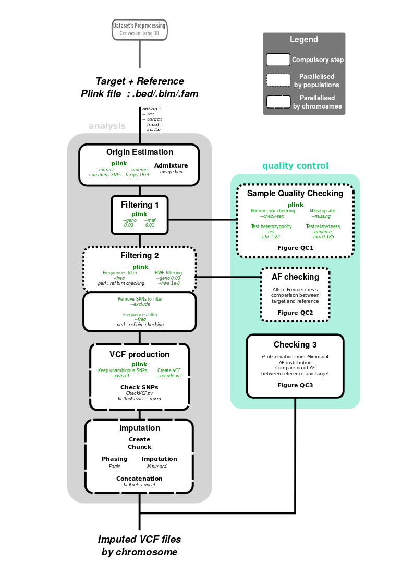
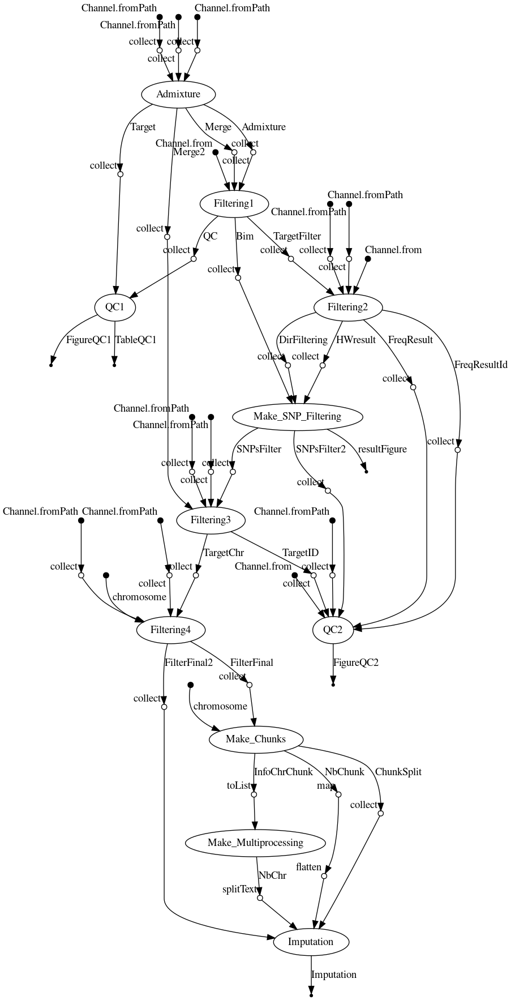

# Imputation genotypage : Pipeline
## A nextflow pipeline to realise a dataset's imputation genotypage

[](https://circleci.com/gh/IARCbioinfo/template-nf)
[](https://hub.docker.com/r/iarcbioinfo/template-nf/)
[](https://singularity-hub.org/collections/1404)
[](https://zenodo.org/badge/latestdoi/94193130)



## Description
The pipeline used to perform the imputation of several targets datasets processed with standard input.

Here is a summary of the method:
- Preprocessing of target dataset if necessary : by using the nextflow script Preparation_dataset.nf which take the dataset plink file (.bed/.bim/.fam) in input.
- First step : Origin estimation of several population from the target dataset by using admixture tools and a dataset of reference.
- Second step : SNPs filtering by population.

See the Usage section to test the full pipeline with the HGDP dataset like admixture's reference.

## Dependencies
The pipeline works under Linux distributions.

1. This pipeline is based on [nextflow](https://www.nextflow.io). As we have several nextflow pipelines, we have centralized the common information in the [IARC-nf](https://github.com/IARCbioinfo/IARC-nf) repository. Please read it carefully as it contains essential information for the installation, basic usage and configuration of nextflow and our pipelines.

2. External software:
- LiftOver : conda install ucsc-liftover
- Plink (PLINK v1.90b6.12 64-bit (28 Oct 2019)) : conda install plink
- Admixture (ADMIXTURE Version 1.3.0) : conda install admixture
- Perl : conda install perl
- Term::ReadKey module : conda install perl-termreadkey
- BcfTools : conda install bcftools

3. File to download :
- [Hapmap Dataset](zzz.bwh.harvard.edu/plink/dist/hapmap_r23a.zip) : as reference's dataset for admixture
- [HGDP Dataset](http://www.hagsc.org/hgdp/data/hgdp.zip) : for the dataset's test, you have to use the toMap.py & toPed.py in the 'converstion' directory to convert files in the .map/.ped plink format. Next you have to convert this last output in the .bed/.bam/.fam plink format by using plink line command and run the imputation's pipeline.
- Perl tools : [1](https://www.well.ox.ac.uk/~wrayner/tools/HRC-1000G-check-bim-v4.2.11.zip) & [2](https://www.well.ox.ac.uk/~wrayner/tools/1000GP_Phase3_combined.legend.gz)
- [LiftOver tools](http://hgdownload.cse.ucsc.edu/goldenpath/hg18/liftOver/hg18ToHg19.over.chain.gz)
- Pipeline tools : [1](https://www.ncbi.nlm.nih.gov/pmc/articles/PMC2432498/bin/pone.0002551.s003.xls) (Convert it in .csv format) & [2](ftp://ftp.ncbi.nlm.nih.gov/hapmap/genotypes/2009-01_phaseIII/plink_format/relationships_w_pops_121708.txt)
- [CheckVCF](https://github.com/zhanxw/checkVCF/raw/master/checkVCF.py)
- [HumanV37](http://ftp.1000genomes.ebi.ac.uk/vol1/ftp/technical/reference/human_g1k_v37.fasta.gz)


You can avoid installing all the external software by only installing Docker. See the [IARC-nf](https://github.com/IARCbioinfo/IARC-nf) repository for more information.


## Input
  | Type      | Description     |
  |-----------|---------------|
  | Reference/Target Plink dataset | Corresponds to the reference's dataset and the dataset to be analyzed, both already preprocessed by filters found in the Preparation_dataset.nf. Composed by the following files : bed, bim & fam |


  Specify the test files location

## Parameters

  * #### Mandatory
| Name      | Example value | Description     |
|-----------|---------------|-----------------|
|--input| user/main_data/ | The path of the main directory. WARNING : for now, you have to create a 'user/main_data/data_start' directory where we can find all the data to download before to run the script. |
| --ref | hapmap_r23a | Pattern of the admixture's reference dataset which do the link with the file .bed/.bim./fam for plink. The data have to be placed in the main directory and in a directory which have the same name that the parttern name of the dataset (for example : 'user/main_data/hapmap_r23a'). |
| --target | HGDP | Pattern of the target dataset which do the link with the file .bed/.bim./fam for plink. The data have to be placed in the main directory and in a directory which have the same name that the parttern name of the dataset. |
|--script | my/directory/script/bin | The path of the bin script directory, to be able to run the annexe programme grom the pipeline (for example : 'user/main_data/HGDP') |

  * #### Optional
| Name      | Default value | Description     |
|-----------|---------------|-----------------|
| --param3   |            xx | ...... |
| --param4    |            xx | ...... |

  * #### Flags

Flags are special parameters without value.

| Name      | Description     |
|-----------|-----------------|
| --help    | Display help |
| --flag2    |      .... |


## Usage
1. Download all the necessary file to run the full pipeline (See the dependencies section, part 3).
2. Prepare the dataset to the imputation pipeline. Here we take the HGDP dataset as target and the Hapmap dataset as reference to run admixture tools. To make sure that the data is available to use, you have to convert the .txt's HGDP file in the good plink format. To do this, use the script toMap.py & toPed.py that you can find in the directory bin/. (Make sure taht more that 30go of memory are free before to run the toPed.py script)

  ```
  python3 toMap.py
  python3 toPed.py
  ```
  
After you have to convert the .ped/.map file in .bed/.bim/.bam file with the use of plink line and copy it in a directory.
  
  ```
  plink --map HGDP.map --ped HGDP.ped --make-bed --out HGDP
  ```

And then we can run the nextflow script to prepare the both dataset.

  ```
  nextflow run Preparation_dataset.nf --dataset HGDP
  nextflow run Preparation_dataset.nf --dataset hapmap_r23a
  ```
3. Now you can run the imputation pipline nextflow script to run the Origin estimation and the SNPs filtering steps.

  ```
  nextflow run Imputation_genotypage.nf --ref hapmap_r23a --target HGDP --input /main_data/ --script /script/bin/

  ```

## Output
  | Type      | Description     |
  |-----------|---------------|
  | output1    | ...... |
  | output2    | ...... |


## Detailed description (optional section)
...

## Directed Acyclic Graph
[](http://htmlpreview.github.io/?https://github.com/IARCbioinfo/template-nf/blob/master/dag.html)

## Contributions

  | Name      | Email | Description     |
  |-----------|---------------|-----------------|
  | contrib1*    |            xx | Developer to contact for support (link to specific gitter chatroom) |
  | contrib2    |            xx | Developer |
  | contrib3    |            xx | Tester |

## References (optional)

## FAQ (optional)
# test-pipeline
